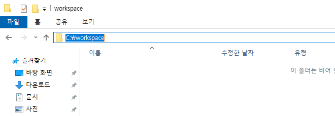
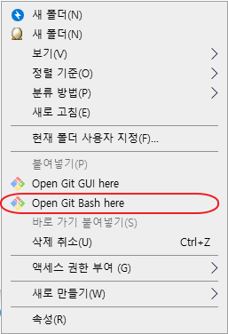
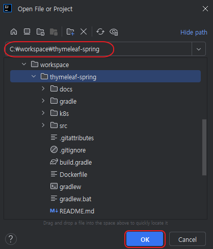
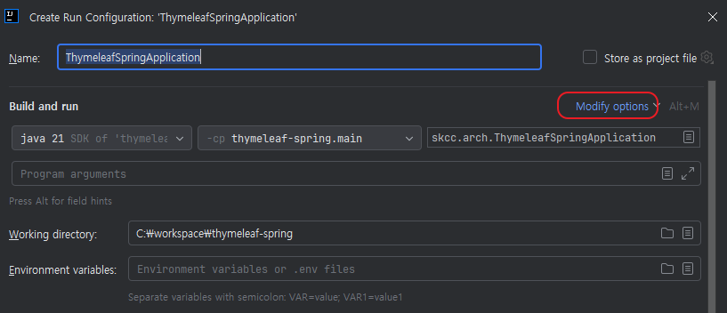
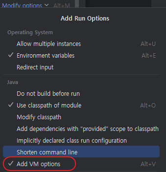
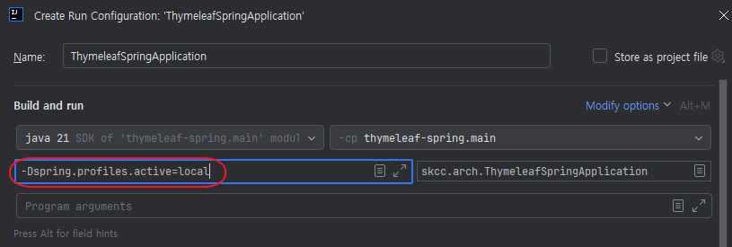
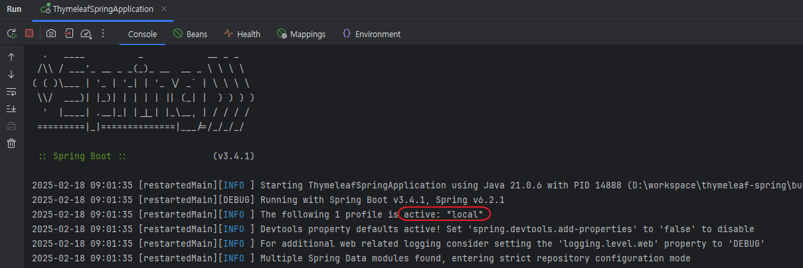

# 소스 다운로드 및 실행
>
> SpringBoot Template 소스 다운로드 및 실행 가이드 입니다.  
> 사전 설치 및 세팅은 완료되었다는 가정하에 설명합니다.  
> (Intellij Community 버전으로 설명)

## 소스 다운로드
>
> Repository 주소는 변경 될수 있습니다.

1. 소스를 저장할 임의 디렉토리 생성 (예시: C:\\workspace)  
  

2. 디렉토리 폴더 내 우클릭 `Open Git bash here` 클릭  


3. git clone
   - git repo 주소: <https://github.com/byounghoonmoon/skcc-spring-template.git>  
  **주소는 변경될 수 있습니다.**  
  

## 소스 실행
>
> Intellij Community 버전으로 설명합니다.

1. Intellij 실행
2. File - Open - 다운로드 받은 소스 디렉토리 선택  
   
3. Project 오픈 시, Gradle 자동 인식 하여 관련 `library 다운로드 자동 수행`  
   **별도 Nexus Repository 설정** 필요한 경우 `build.gradle` 및 `settings.gradle` repo URL 설정
   - build.gradle (사내 gdi 적용)

      ```gradle
      repositories {
         // 폐쇄망일 경우 사내 Nexus 이용
         maven {
             url 'https://gdi-nexus.gdi.cloudzcp.net/repository/maven-central'
         }
         //mavenCentral()
      }
      ```

   - settings.gradle (사내 gdi 적용)

      ```gradle
      // 폐쇄망
      pluginManagement {
         repositories {
            maven {
                  url 'https://gdi-nexus.gdi.cloudzcp.net/repository/maven-central'
            }
         }
      }
      rootProject.name = 'skcc-spring-template'
      ```

4. 만약, **JDK 설정이 안되었을 경우** 프로젝트 설정에서 JDK 설정(File-Project-Structure 또는 단축키[Ctrl+Alt+Shift+S])에서 세팅
   

5. Spring Main Class 소스 이동 → 실행 클릭 → `modify Run Configuration` 클릭
   

6. `Modify Options` 클릭
   

7. `Add VM options` 클릭  
   

8. `-Dspring.profiles.active=local` 입력 (로컬환경 구동, 환경별 변수 입력)  
   

9. `Application` 실행 (상단의 삼각형)
     
   실행결과
   
   